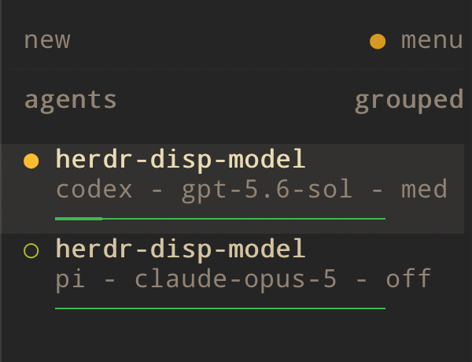

# Herdr Model Display

Herdr Model Display is a Herdr plugin that shows the active AI model and reasoning effort for Codex CLI, Claude Code, Pi, and Hermes Agent directly in the agent sidebar. Model names and effort levels update automatically when sessions start or users switch them:

```text
codex - gpt-5.6 - med
claude - claude-opus-5 - high
pi - claude-sonnet-4-6 - xh
hermes - gpt-5.4 - low
```



*The green status bars shown beneath the agents come from [Herdr Context Bar](https://github.com/pdalinis/herdr-ctx-bar), a separate plugin.*

The plugin uses harness lifecycle hooks and Herdr's display-only pane metadata. It does not scrape terminal output or take over Herdr's agent lifecycle state.

## Status

- Codex: automatic session, model, and effort updates
- Claude: automatic session and live model/effort updates
- Pi: automatic session and live model/effort updates
- Hermes: automatic per-turn model and effort updates
- Platforms: macOS and Linux
- Requirements: Herdr 0.9.0+ and Python 3

## Install

```sh
herdr plugin install pdalinis/herdr-disp-model
herdr plugin action invoke dev.pdalinis.model-display.setup-all
```

Restart running harness sessions after setup. Pi can instead load its adapter immediately with `/reload`. Codex may ask you to review and trust its newly installed hook before it runs.

Claude model-switch tracking uses `PostModelSwitch`, available in Claude Code 2.1.251 and newer. On older Claude versions, the adapter reports the current model and effort when the session starts and when the next prompt is submitted, but cannot update immediately after `/model` changes.

The default Herdr sidebar works without additional configuration because the plugin reports a display name such as `codex - gpt-5.6 - med`. Effort levels are shortened to `off`, `min`, `low`, `med`, `high`, `xh`, `max`, or `ult`. If a harness does not expose an effort level, the plugin keeps the original `harness - model` format.

## Custom sidebar layout

The plugin also reports `$model` and `$effort` tokens. To control placement yourself, add them after `agent` in `~/.config/herdr/config.toml`:

```toml
[ui.sidebar.agents]
rows = [
  ["state_icon", "machine", "workspace", "tab"],
  ["agent", "$model", "$effort"],
]
```

Herdr separates tokens with `·`, producing `codex · gpt-5.6 · med`. Reload the configuration with:

```sh
herdr server reload-config
```

## Check or remove setup

```sh
herdr plugin action invoke dev.pdalinis.model-display.status
herdr plugin action invoke dev.pdalinis.model-display.remove-all
```

Remove the companion hook before uninstalling the plugin:

```sh
herdr plugin action invoke dev.pdalinis.model-display.remove-all
herdr plugin uninstall dev.pdalinis.model-display
```

## Adapter interface

Unsupported harness adapters can call the dependency-free reporter directly:

```sh
python3 src/model_display.py report \
  --pane "$HERDR_PANE_ID" \
  --harness claude \
  --model opus \
  --effort high
```

Clear stale metadata when the harness session ends:

```sh
python3 src/model_display.py clear \
  --pane "$HERDR_PANE_ID" \
  --harness claude
```

Each supported harness can also be managed independently with `setup-codex`, `setup-claude`, `setup-pi`, `setup-hermes`, and the corresponding `remove-*` action.

## Development

```sh
python3 -m unittest discover -s tests -v
herdr plugin link "$PWD" --disabled
```

## How it works

Each adapter uses its harness's native model signal:

- Codex provides `model` to command hooks; the adapter resolves the session effort override or the selected model's default.
- Claude provides model and effort data to its lifecycle hooks.
- Pi exposes `ctx.model`, `ctx.thinkingLevel`, and live selection events.
- Hermes provides the effective model request to its `pre_api_request` Python plugin hook.

The adapters call `herdr pane report-metadata` to update the pane's visible agent label plus `$model` and `$effort` tokens without taking over lifecycle state. Setup preserves existing Codex and Claude hooks.

The command-hook adapters are copied into Herdr's stable plugin configuration directory, so GitHub-managed plugin reinstalls do not leave Codex or Claude pointing at a replaced checkout.

The implementation follows Herdr's [plugin](https://herdr.dev/docs/plugins/) and [pane metadata](https://herdr.dev/docs/socket-api/) APIs. See the native [Codex hooks](https://developers.openai.com/docs/hooks), [Claude hooks](https://code.claude.com/docs/en/hooks), [Pi extensions](https://github.com/badlogic/pi-mono/blob/main/packages/coding-agent/docs/extensions.md), and [Hermes hooks](https://github.com/NousResearch/hermes-agent/blob/main/website/docs/user-guide/features/hooks.md) documentation.

## License

MIT
